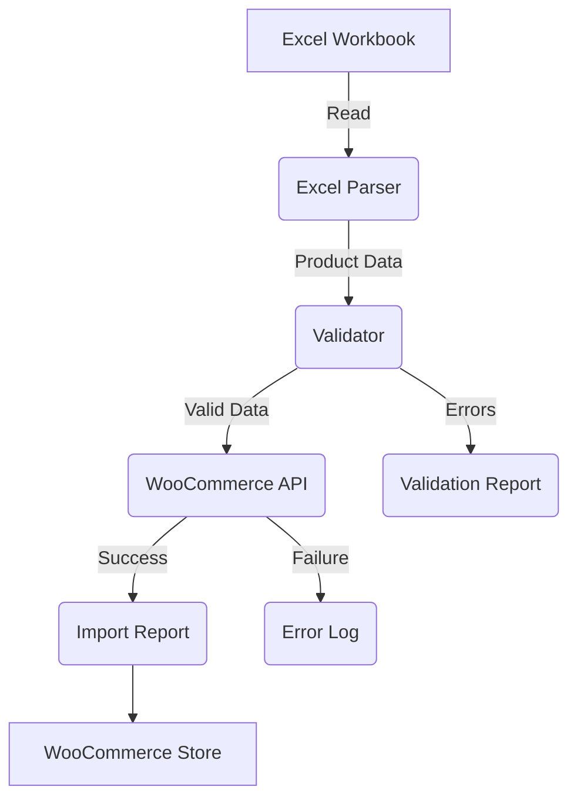

# System Architecture

## Overview
The **AI-Powered WooCommerce Product Automation System** is a modular Python application designed to automate product imports from Excel to WooCommerce.

## Modules
| Module               | Responsibility                                                                                     |
|----------------------|----------------------------------------------------------------------------------------------------|
| **Excel Parser**     | Reads and parses the Excel workbook (`Product_Master.xlsx`).                                      |
| **Validator**        | Validates product data (required fields, SKU uniqueness, price ranges, etc.).                     |
| **WooCommerce API**  | Interacts with the WooCommerce REST API to create/update products and variations.                 |
| **Image Manager**    | Downloads, validates, and uploads images to WordPress.                                             |
| **AI Processing**    | Generates SEO titles, descriptions, tags, and category suggestions using OpenAI.                  |
| **Automation**       | Handles batch imports, scheduling, and progress tracking.                                          |

## Data Flow

## Configuration
All settings are managed in `config/settings.yaml`. See [Configuration Guide](#) for details.