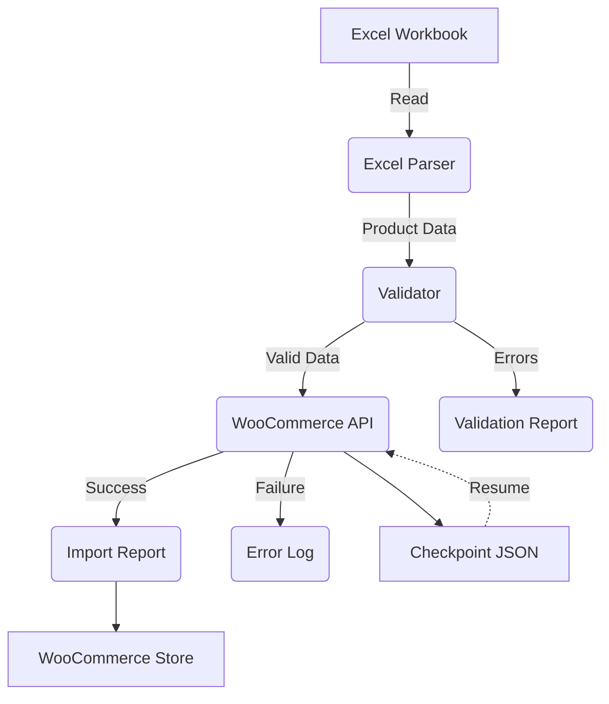

# System Architecture

## Overview
The **AI-Powered WooCommerce Product Automation System** is a modular Python application designed to automate product imports from Excel to WooCommerce with crash recovery and FTP bulk upload support.

## Modules
| Module               | Responsibility                                                                                     |
|----------------------|----------------------------------------------------------------------------------------------------|
| **Excel Parser**     | Reads and parses the Excel workbook (`Product_Master.xlsx`).                                      |
| **Validator**        | Validates product data (required fields, SKU uniqueness, price ranges, etc.).                     |
| **WooCommerce API**  | Interacts with the WooCommerce REST API to create/update products and variations.                 |
| **Image Manager**    | Downloads, validates, and uploads images (REST API or FTP).                                       |
| **AI Processing**    | Generates SEO titles, descriptions, tags, and category suggestions using OpenAI.                  |
| **Automation**       | Handles batch imports, scheduling, and progress tracking with checkpoints.                        |

## Data Flow


## Import Pipeline Stages

Each product goes through these stages with checkpointing:

1. **Product Created** → Product exists in WooCommerce (by SKU)
2. **Variations Created** → All variations synced (idempotent)
3. **Images Uploaded** → All images attached (REST API or FTP)
4. **Completed** → Fully imported

If the process crashes, `--resume` skips completed products.

## Image Upload Modes

### REST API Mode (default)
- Images uploaded via WordPress REST API (`/wp-json/wp/v2/media`)
- Checks media library by filename before uploading (no duplicates)
- Rate limited to prevent 429 errors

### FTP Mode (for 1000+ images)
- Bulk upload via FTP to `wp-content/uploads/YYYY/MM/`
- PHP script registers files as WordPress media
- Much faster than REST API for large batches

## Crash Recovery

### Checkpoints
- Saved to `output/import_checkpoint.json` after each stage
- Contains: SKU, stage, product_id, timestamp
- Survives process crashes

### Resume
```bash
# Skip completed products, continue from last checkpoint
python -m src.main --resume

# Re-run only failed products
python -m src.main --retry-failed
```

### Partial Reports
- `import_report.xlsx` written every 10 products
- Final report at end of import
- Contains success/failure per SKU

## Configuration
All settings are managed in `config/settings.yaml`. See [Configuration Guide](DEVELOPMENT_GUIDE.md) for details.

## Key Files
| File | Purpose |
|------|---------|
| `src/main.py` | Entry point, CLI argument parsing |
| `src/automation/importer.py` | Batch import with checkpointing |
| `src/automation/tracker.py` | Progress tracking, checkpoints |
| `src/woocommerce/client.py` | WC API client, product/variation CRUD |
| `src/image_manager/manager.py` | Image workflow orchestration |
| `src/image_manager/uploader.py` | REST API image upload |
| `src/image_manager/ftp_uploader.py` | FTP bulk upload |
| `scripts/ftp-register-media.php` | WordPress media registration |
